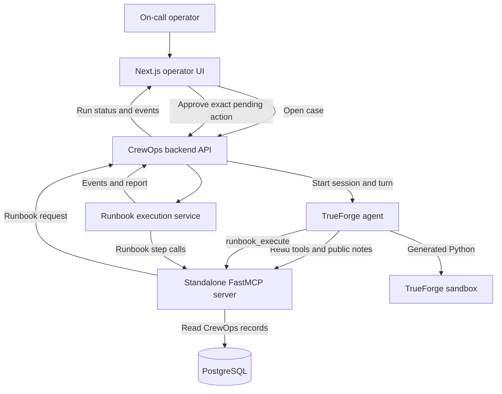
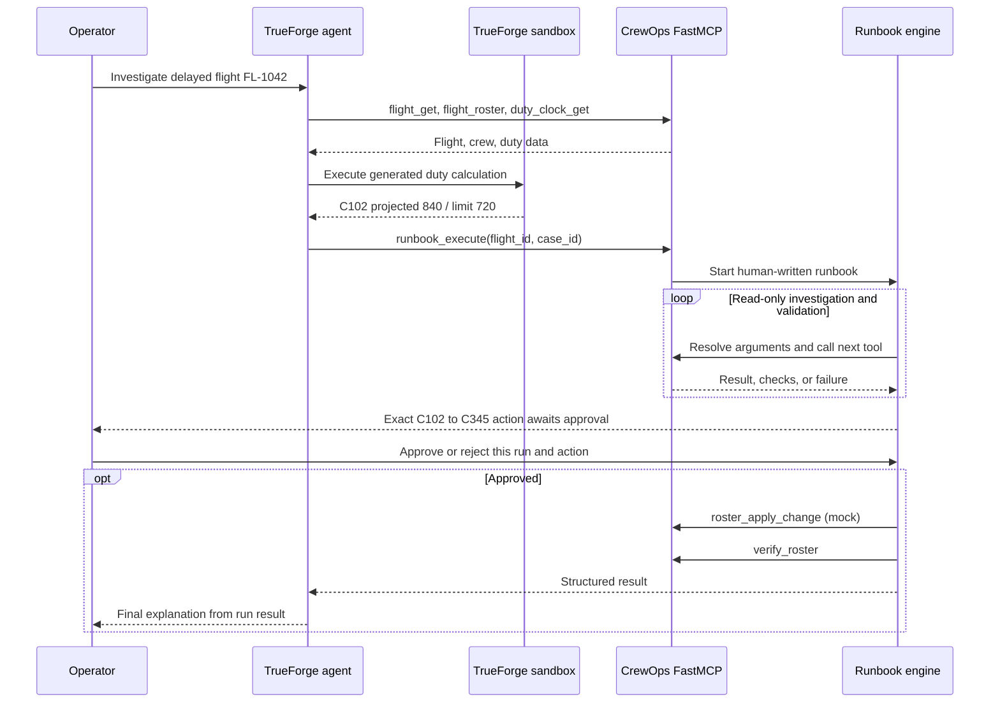

# CrewOps: an on-call agent for crew duty risk

## The problem

At 3 a.m., an operations controller may learn that a flight is delayed while its assigned crew is already partway through a duty period. The controller needs to answer several questions quickly: Which flight and crew are affected? Does the new departure create a duty-limit conflict? Is a qualified reserve available? Would a substitution introduce another conflict? What can be done immediately, and what needs a person to approve?

The information lives in separate flight, roster, duty-clock, certification, and reserve records. Looking up each record, doing the arithmetic, checking a candidate, and documenting the decision is repetitive work under time pressure. A wrong roster change also has a larger consequence than a wrong summary. CrewOps is designed to perform the investigation while keeping the action boundary under human control.

**The job:** Given an operator report such as “FL-1042 is delayed by 240 minutes; check the crew duty risk,” investigate the live CrewOps records, propose a supported replacement if necessary, stop for approval, and verify the result.

This is an operations-assistance demo. Its recorded duty limit and arithmetic are sample data, not a claim of regulatory or dispatch authority.

## What the current demo does

The seeded case has a 240-minute delay on FL-1042. Crew C102 has 600 recorded duty minutes and a 720-minute recorded limit. The projected total is **600 + 240 = 840 minutes**, or **120 minutes over** that limit. Crew C231 remains below its recorded limit. The system finds reserve C345, validates the candidate, and checks the proposed C102 → C345 substitution against the current roster before asking for approval.

| Stage | Current behavior |
| --- | --- |
| Intake | The backend accepts a report containing a flight ID and a delay or duty concern, then selects the one supported human-written runbook. |
| Agent investigation | TrueForge calls CrewOps `flight_get`, `flight_roster`, and `duty_clock_get` through FastMCP. It uses the returned values to generate and run Python in its native sandbox. |
| Runbook execution | After a duty risk is found, the agent calls `runbook_execute`. The backend loads the YAML runbook, resolves later arguments from earlier results, and calls CrewOps MCP tools for investigation, reserve search, validation, and read-only simulation. |
| Safety gate | Before `roster_apply_change`, the backend stops in `WAITING_FOR_APPROVAL` and records the exact pending action. |
| Human decision | The operator reviews the proposed change and either approves or rejects it. Approval resumes the **same run**. |
| Verification | After approval, the mock roster action runs and `verify_roster` checks that the database roster stayed unchanged, as the mock promises. |

The runbook is [human-written YAML](../crewops-agent/runbooks/crew_duty_risk_resolution.yaml). The agent may interpret live data and decide whether the supported duty-risk procedure is needed; it cannot invent a replacement procedure or bypass the backend's approval gate.

## Why TrueForge matters here

[TrueForge](https://github.com/truefoundry/trueforge/blob/main/docs/introduction.mdx), the open-source agent harness from TrueFoundry, supplies the **agent execution loop**: model calls, MCP tool routing, a sandbox for generated code, streaming events, and session handling. In CrewOps, this is observable work. The TrueForge session reads real CrewOps data, runs a generated duty calculation in the sandbox, and then decides whether to call the runbook tool. The Harness page shows those tool calls and results; public agent notes appear only when the model actually emits them.

| CrewOps need | What TrueForge provides in this demo | What to show |
| --- | --- | --- |
| Reach operational records | MCP tool routing for the agent | The actual `flight_get`, `flight_roster`, and `duty_clock_get` calls and responses. |
| Work with discovered numbers | On-demand sandbox code execution | Agent-generated Python using returned duty values and its printed calculation. |
| Explain and inspect the agent's work | Streamed turn and tool events | The TrueForge session and the linked Harness case trace. |
| Hand work to the approved procedure | An agent-selected MCP call | `runbook_execute` with the flight and case IDs after the risk calculation. |

CrewOps adds the domain-specific controls TrueForge cannot infer from a prompt alone: a human-authored procedure, explicit tool allowlists, exact-action approval, result validation, and a final verification step. The backend currently executes the nine runbook steps behind one `runbook_execute` MCP call. **TrueForge does the initial investigation; the backend owns the runbook state machine.** CrewOps does not currently use TrueForge's native approval feature for the roster action or TrueFoundry's enterprise AI Gateway. TrueForge's [product description](https://www.truefoundry.com/trueforge) covers broader capabilities; this project demonstrates only the ones described above.

## System architecture

There are three projects in this repository: [backend](../crewops-agent/), [FastMCP server](../mcp-server/), and [operator UI](../frontend/). TrueForge is an external runtime started alongside them. The frontend's server-side API proxy talks to the backend. The FastMCP server exposes database-backed CrewOps tools and forwards `runbook_execute` to the backend. The backend calls the MCP tools again as it advances the runbook.

## Agent and execution architecture

### Who decides what?

| Component | Responsibility |
| --- | --- |
| TrueForge agent | Read live evidence, calculate projected duty in the sandbox, decide whether the supported runbook is needed, and explain the returned result. |
| Human-written runbook | Define the permitted sequence, tool names, argument references, conditions, timeouts, and destructive declaration. |
| Backend engine | Own run state, resolve arguments from previous results, enforce tool policy, validate outcomes, stop at approval, resume, and verify. |
| Human operator | Decide whether the displayed pending roster action may proceed. |
| FastMCP server | Provide the CrewOps tool boundary, database reads, read-only simulation, mock action, and runbook proxy. |

The runbook's `when` conditions and `${previous_step.field}` references pass discovered values into later tools. A missing reserve, invalid candidate, failed simulation, tool error, or failed final verification blocks or fails the run before it can be reported as resolved.

## The safety boundary

The backend automatically executes only tools on its read-only allowlist. A step marked destructive, or a tool outside that allowlist, requires approval. When the proposed roster step is reached, the engine stores the `run_id`, `runbook_id`, exact `step_id`, exact `tool`, resolved `arguments`, approval ID, expiry, and a hash of the pending action. The approval API checks these values against the stored action. A generic “approve whatever is next” message cannot release the gate.

The run state moves from `RUNNING` to `WAITING_FOR_APPROVAL`, then to `APPROVED` and back to execution if the human approves. Rejection ends that run without calling the roster tool. Approval resumes the stored run at its pending step; it does not start a fresh investigation.

The human sees the current and proposed roster, the candidate checks, and the read-only simulation result before approving. The simulation performs database reads and validation; it is **separate from TrueForge's code sandbox**. If approved, the current demo calls a **mock** `roster_apply_change` that returns `mock=true` and `mutated=false`. Final verification confirms the stored roster did not change. A production roster write would require durable run state, authenticated operators, idempotency, and stronger concurrency controls.

## What a judge can verify in five minutes

1. Start the four local processes using the [root README](../README.md), then open the prefilled FL-1042 case.
2. On `/harness/{case_id}`, show the actual TrueForge MCP reads, generated sandbox code, and sandbox result. Public agent updates are model-authored when present; private model reasoning is not shown.
3. Follow the linked run to see the backend execute the human-written procedure and stop at `WAITING_FOR_APPROVAL` before the roster action.
4. Review the exact C102 → C345 proposal and approve it once.
5. Show the same run resume, execute the mock action, call `verify_roster`, and produce a result that explicitly says no roster row was changed.

## Current scope and limits

The MVP supports one delayed-flight crew duty-risk runbook. The seed database also contains FL-1050, but it does not provide a second resolution scenario. The backend stores run and Harness case state in memory, so restarting it loses those histories and pending approvals. The JSONL event log is for observation, not state recovery. The default local UI has no operator login. The approved roster action is a mock; a completed mock run demonstrates the approval and verification loop, **not** a production roster mutation. The last change that added model-authored `agent_note` updates has passed static checks but still needs a fresh live TrueForge run to confirm how often the selected model emits notes.
